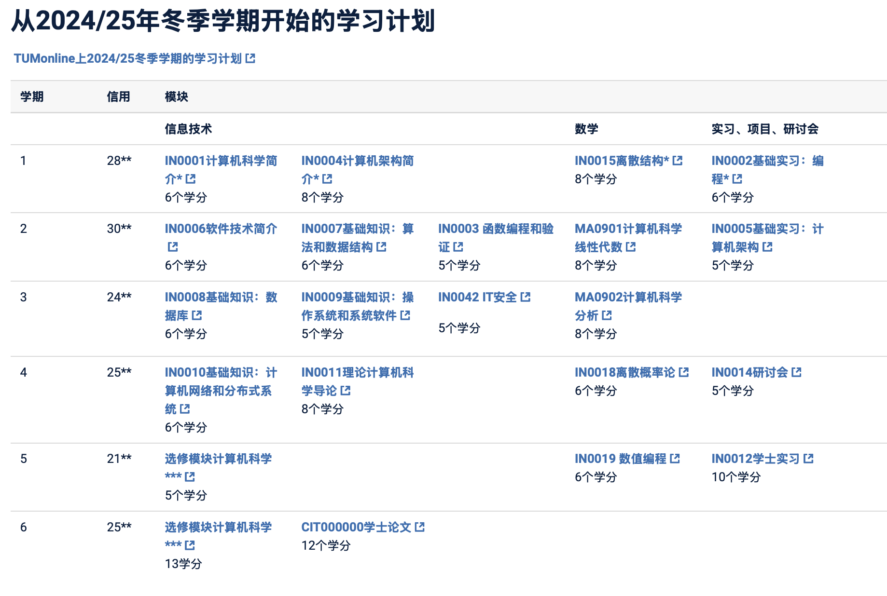

Simon会在2027fall申请，现在仅作调查，希望能帮助到有需要的人
本文以计算机方面为主。

### 资料来源

本文所有资料均来自于TMU官网中[School of Computation,Information and Technology板块](https://www.cit.tum.de/en/cit/home/)，以下简称CIT学院。
其中具体信息主要来自于其中的[学位项目板块](https://www.cit.tum.de/en/cit/studies/degree-programs/)

### 硕士学制  
标准学制2年，以课程为主  
### 在当地工作
毕业后到慕尼黑外国人事务局（KVR）把原来的学生居留直接换成“18 个月求职居留”（§ 16b Abs. 4 AufenthG）。    
在这 18 个月内可以无限制打工（不限天数、不限行业），以维持生活并积累相关经验  
找到与学位匹配的“合格工作”后，可立即把求职居留转换成“就业居留”（§ 18b AufenthG）。   
只要这份工作持续 24 个月、并缴纳社保，且德语达到 A1，就能申请德国永久居留。（https://www.community.tum.de/wp-content/uploads/2023/04/TU_Flyer_WorkingInGermany2023_WEB.pdf）   
  

### CIT本科专业

信息来自于[学位项目板块](https://www.cit.tum.de/en/cit/studies/degree-programs/)

- 生物信息学
- 电气和计算机工程
- 电子和数据工程（在新加坡TUM亚洲）
- 信息学
- 信息学：游戏工程
- 信息工程
- 信息系统
- 数学

### 本科信息学（Informatics）培养方案（用于检查课程匹配度）

[网址](https://www.cit.tum.de/cit/studium/studiengaenge/bachelor-informatik/studienplan/)
翻译如下：

对Simon个人而言，这个专业是最契合国内本科计算机科学专业培养方案的。

### 本科信息工程（Information Engineering）培养方案

[官网文件](https://www.cit.tum.de/fileadmin/w00byx/cit/Studium/Studiengaenge/Bachelor_Information_Engineering_Heilbronn/20221213_Studiengangsdokumentation_BSc_IE_Teil_A_AbgabeSenat__1_.pdf)
主要内容翻译如下：

| 类别                                                   | 学分  | 说明                                           |
| ------------------------------------------------------ | ----- | ---------------------------------------------- |
| **必修：计算机科学**                             | 90 CP | 信息学核心课程                                 |
| **必修：数学**                                   | 36 CP | 离散结构、线性代数、微积分、概率论             |
| **选修：计算机科学**                             | 12 CP | 从实时系统、虚拟机、密码学等模块中选 2 门      |
| **选修：经济/管理**                              | 18 CP | 财务会计、管理科学、物流与生产等 3 门          |
| **选修：跨学科/软技能**                          | 9 CP  | 伦理、创业、跨文化沟通等                       |
| **毕业论文 + 答辩**                              | 15 CP | 第 6 学期完成（12 CP 论文 + 3 CP 答辩）        |
| **必修实践项目**                                 | 10 CP | 第 5 学期小组项目（Bachelor Practical Course） |
| **必修研讨课**                                   | 5 CP  | 第 3 学期独立完成科研小课题                    |
| 添加了一些经管类课程，其他本科专业大同小异，不再赘述。 |       |                                                |

### CIT硕士专业

信息来自于[学位项目板块](https://www.cit.tum.de/en/cit/studies/degree-programs/)
生物信息学
生物医学计算
通信和电子工程
计算科学与工程
数据工程和分析
电气和计算机工程
财务和信息管理（与TUM管理学院合作）
绿色电子（在新加坡TUM亚洲）
信息学
信息学：游戏工程
信息工程
信息系统
集成电路设计（在新加坡TUM亚洲）
数学
数学金融和精算科学
数据科学中的数学
运筹学中的数学
科学与工程中的数学
微电子和芯片设计
神经工程——精英硕士课程
机器人、认知、智能
软件工程——精英研究生课程
TopMath – 精英项目

### 计算科学与工程（Computational Science and Engineering）

这个项目主要以数学仿真为主。
**Please note that CSE is not a computer science program, and students who wish to pursue such a program are not encouraged to apply to CSE. If you are interested in computer science or computer engineering, the Informatics Master's program is for you. The same is true if your primary interest is Robotics or Machine Learning, as these other programs would likely be a better fit for you.**
Simon对此不感兴趣，故掠过，感兴趣可[访问](https://www.cit.tum.de/en/cit/studies/degree-programs/master-computational-science-engineering/)

### 机器人Robotics, Cognition, Intelligence

[主页](https://www.cit.tum.de/en/cit/studium/studiengaenge/master-robotics-cognition-intelligence/#c2284)

- [学费](https://www.tum.de/studium/studienfinanzierung/studiengebuehren-fuer-studierende-aus-nicht-eu-laendern#c124247)
  6000欧元一学期，一年两学期，大多数工科都一样。
- 标准学制：四个学期。
- 教学语言：德语和英语（这就意味着需要德语成绩）
  Simon不符合语言条件，略过。

### 信息学(Informatics)

- [主页](https://www.cit.tum.de/en/cit/studies/degree-programs/master-informatics/)
- 语言：英语
- 申请期限
  - 冬季学期：2月1日至5月31日
  - 夏季学期：9月1日至11月30日
- 申请流程[参考](https://www.tum.de/en/studies/application/master/application-master)
  - [注册](https://campus.tum.de/tumonline/)
  - 能力评估
    - 在初始阶段，您在学士学位课程中获得的成绩以及您的书面文件将使用积分系统进行评估。根据累积的积分数量，申请人要么立即被录取，要么被拒绝，要么被邀请参加该部门进行的20分钟的招生面试。在某些情况下，对国际学生进行电话面试。
    - 面试代表了程序的第二阶段，有助于确定申请人是否能够成功完成所需的学习课程。您可以在您期望的学位课程的学术和考试条例的附录2中找到更多信息。
  - GRE分数要求：**GRE and GATE
    Applicants with a Degree from Bangladesh, China, India, Iran or Pakistan have to submit a GRE (General) Test. We have defined required minimum scores, lower scores will not be accepted!
    The required scores are:
    Verbal reasoning: (will not be taken into account anymore)
    Quantitative reasoning: 164
    Analytical writing: 4.0**
  - VPD：
    德语全称：Vorprüfungsdokumentation
    中文名称：德国大学入学资格预审核证明
    由 Uni-Assist（德国高校国际合作申请服务中心）出具，用于提前审核非欧盟申请者的学历、成绩和学分是否符合德国大学的入学标准，并把成绩换算成德国计分体系。提前3–6个月向 uni-assist 提交材料，因为：uni-assist处理时间通常为 4–6周，高峰期可能更长；VPD有效期为 1年，但部分大学要求VPD必须在申请截止前不超过6个月内开具
  - APS：
    全称 德国驻华使馆文化处留德人员审核部（Akademische Prüfstelle，简称 APS）审核中国学生的学历、成绩单、学位证等材料是否真实有效。
  - 命题小论文：科学论文/论文应长约1000字，并且必须用英语书写

### 总而言之：需要托福GRE过关，如果能在第一轮能力评估中通过（学科契合度以及GPA）就会直接录取，否则就要经过面试和考试。